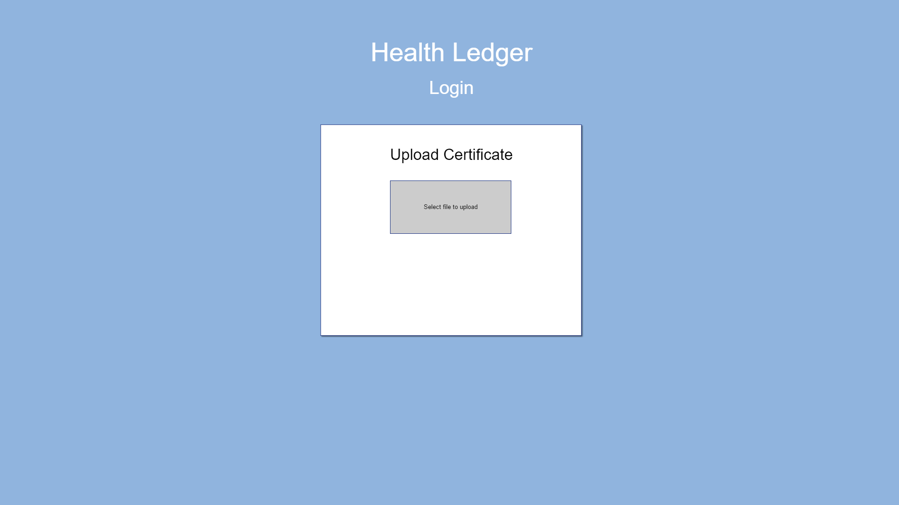
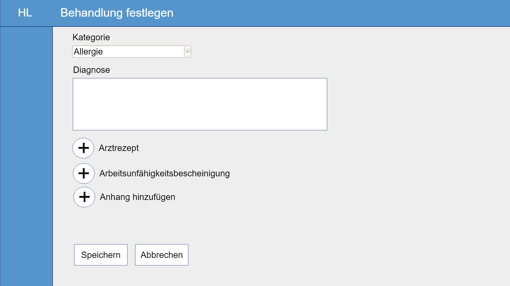
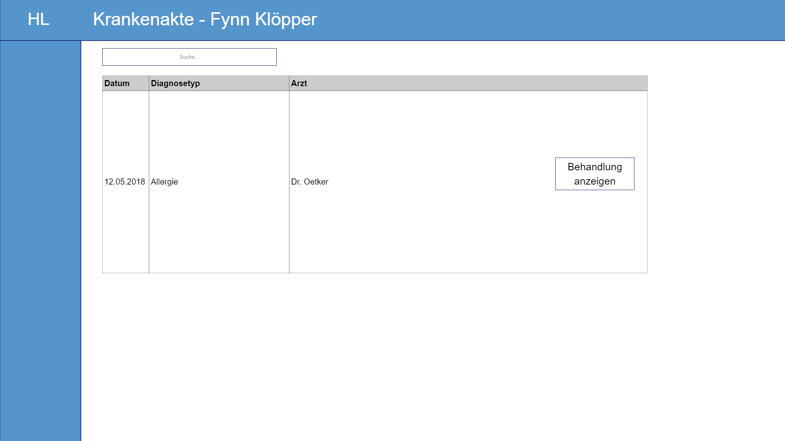
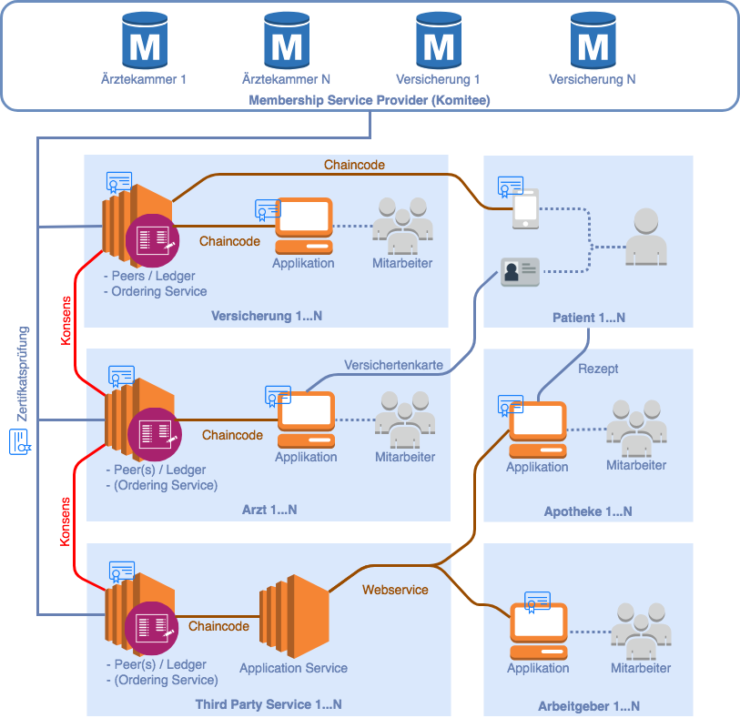
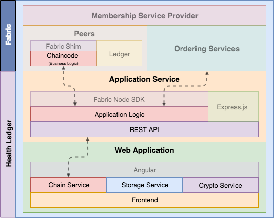
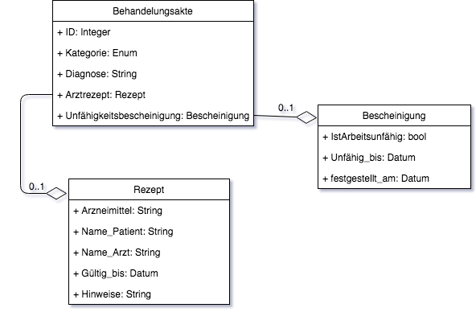
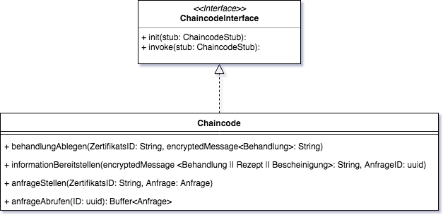
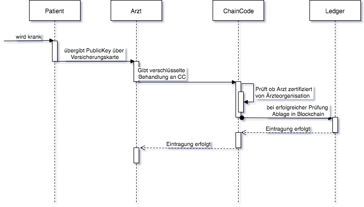
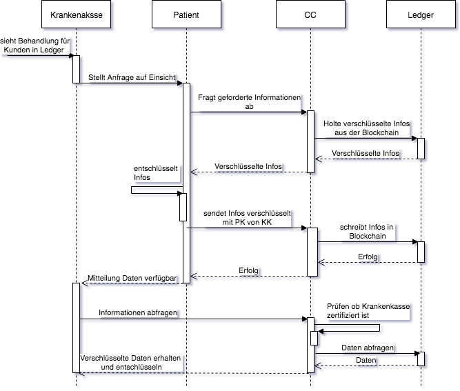

# Anforderungs- und Entwurfsspezifikation ("Pflichtenheft")

Health Ledger: Die digitale Patientenakte

Autoren: ...

# 1 Einführung

## 1.1 Beschreibung (Mario)
Als besonders schutzbedürftige Informationssammlung ist die Krankenakte tief in die persönliche Privatsphäre eingebettet. Die Kontrolle, wer wann in welchem Umfang Zugriff auf Krankendaten erhält, ist im aktuellen Gesundheitssystem für den Patienten nicht nur mangelhaft nachvollziehbar, sondern auch erheblich durch die segmentierte Vorhaltung in verteilten Heilanstalten und Versicherungsdienststellen erschwert. Auch wenn eine zentralisierte Patientenkartei diesen Problemen eine Lösung zu sein scheint, ergeben sich im Rahmen einer institutionalisierten Form der Datenhaltung neue Hürden der administrativen Intransparenz. Medizinische Informationsüberlassungen wären lediglich ein gewährter Dienst einer Körperschaft anstatt sich in echter Kontrolle durch den Informationseigner zu konkretisieren.

HealthLedger ist die innovative Antwort auf das Verlangen nach dezentraler und sicherer Speicherung der Gesundheitshistorie bei gleichzeitig höchstpersönlicher Zugriffskontrolle.
Mit Hilfe der verteilten Blockchain-Technologie und modernster Kryptoverfahren wird sichergestellt, dass keine Institution einer Informationsauskunft nachkommen kann ohne Einbezug und Einwilligung des Patienten.

Als Grundbedingung des Heilerfolges ist die Unterstützung der bestmöglichen Zusammenarbeit von Patient, Arzt und Versicherer das höchste Ziel von HealthLedger. Der Mechanismus vereint deshalb die Bedürfnisse aller am Genesungsprozess beteiligten Weggefährten. Dank der Garantie informationeller Selbstbestimmung wird dabei erstmalig eine echte Verantwortungsbalance geschaffen.

## 1.2 Ziele
Features von HealthLedger

* Die unkontrollierbare, nicht nachvollziehbar verteilte Patienteninformation wird durch Digitalisierung in eine elektronische, konzeptionell zentrale Akte überführt.

* Vollständige Kontrolle über die Freigabe der Patientendaten liegt mit variabel wählbarer Transparenzgranularität beim Informationseigner selbst.

* Dank der elektronischen Persistierung kann die Krankenakte global abgerufen und eingesehen werden. Auf Reisen übliche medizinische Sonderdokumente sind somit vollständig ersetzbar. Behandlungsrisiken können zu jeder Zeit an jedem Ort der Welt korrekt von medizinischem Fachpersonal evaluiert werden um den Behandlungserfolg auch in Notfällen sicherstellen zu können.

* Therapiegenehmigungsverfahren werden mittels smarter Vernetzung aller Beteiligten massiv beschleunigt. Die Reduktion von Verzögerungen in der Genesung ist das immanente Resultat.

* Durch Chaincode-Verschreibungen wird die papierlose Medikation ermöglicht. Nicht nur ist die Wahrscheinlichkeit einer Falschverabreichung rigoros eingedämmt, die Transparenz der Wechselseitigkeit von Eigen- und Versicherungsleistung nimmt auch deutlich zu. So sind bereits vor Ankunft in der Apotheke alle Fragen zur Finanzierung der Therapie geklärt.

* Gemessen an den sehr unterschiedlichen Bedürfnissen und Hintergründen der Systemnutzer liefert HealthLedger maßgeschneiderte Oberflächen für das Anwenderspektrum zwischen medizinischem Laien, Facharzt und Versicherungsdienstleister. Im gleichen Zuge kann als Zusatzvorteil eine selektive Kurzeinsicht gewährt werden, um zum Beispiel den Arbeitgeber frühzeitig und papierlos über eine Krankmeldung zu informieren.

HealthLedger bringt die Idee der Krankenakte nach zeitgemäßem technischen Standard in das 21. Jahrhundert. Anders als in Abrechnungs-Softwaresystemen, die gezielt für Versicherungseinrichtungen an den Markt gebracht wurden und Krankendokumente nur als bruchstückhafte Artefakte erzeugen, steht für HealthLedger die Kooperation mit dem Patienten im klaren Fokus. HealthLedger entfernt die unpersönliche Versicherungsbuchhaltung von jenem, was im Mittelpunkt stehen sollte: dem Menschen.

# 2 Anforderungen

## 2.1 Funktionale Anforderungen
* Use-Case Diagramme (Matthias/Mario)

  Vorerst Draw.io XML geshared per GoogleDrive:

  https://drive.google.com/file/d/1pAMpS3cQI8lluesfpWAqOeUHeMnuNVrb/view?usp=sharing

* Akteure
 * Versicherungen
   * “Behandlungen validieren”
 * Apotheker
   * “Smart-Rezept einsehen.”
 * Ärzte
   * “Behandlungen festhalten.”
 * Patienten
   * “Transparenz kontrollieren.”
 * Arbeitgeber
   * “Krankschreibungen einsehen.”

* Strukturierung der Diagramme in funktionale Gruppen (Matthias/Mario)

## 2.2 Nicht-funktionale Anforderungen

### 2.2.1 Rahmenbedingungen
* Normen, Standards, Protokolle, Hardware, externe Vorgaben

### 2.2.2 Betriebsbedingungen
* Vorgaben des Kunden (z.B. Web Browser / Betriebssystem Versionen, Programmiersprache)
* Hyperledger
* Webapp

### 2.2.3 Qualitätsmerkmale (Fynn/Patrick)

Qualitätsmerkmal | sehr gut | gut | normal | nicht relevant
---|---|---|---|---
**Zuverlässigkeit** | | | | |
Fehlertoleranz |X|-|-|-|
Wiederherstellbarkeit |X|-|-|-|
Ordnungsmäßigkeit |X|-|-|-|
Richtigkeit |X|-|-|-|
Konformität |-|X|-|-|
**Benutzerfreundlichkeit** | | | | |
Installierbarkeit |-|-|X|-|
Verständlichkeit |X|-|-|-|
Erlernbarkeit |-|X|-|-|
Bedienbarkeit |-|X|-|-|
**Performance** | | | | |
Zeitverhalten |-|-|X|-|
Effizienz|-|-|-|X|
**Sicherheit** | | | | |
Analysierbarkeit |X|-|-|-|
Modifizierbarkeit |-|-|-|X|
Stabilität |X|-|-|-|
Prüfbarkeit |X|-|-|-|

## 2.3 Graphische Benutzerschnittstelle (Fynn/Patrick)

Behandlung festhalten:

Smart-Rezept ausstellen:

Krankschreibung ausstellen:

Krankenakten einsehen:

Krankenakte einsehen:

* GUI-Mockups passend zu User Stories
* Modellierung der Navigation zwischen den Screens der GUI-Mockups als Zustandsdiagramm

## 2.4 Anforderungen im Detail (Alle)
* User Stories mit Akzeptanzkritierien
* Optional: Name (oder ID) und Priorität ("Must", "Should", "Could", "Won't")
* Strukturierung der User Stories in funktionale Gruppen

### Schablone für User Stories

| **Als** | **möchte ich** | **so dass** | **Akzeptanz** |
| :------ | :----- | :------ | :-------- |
| Wer | Was | Warum | Wann akzeptiert |

Vorerst geshared per Google Tables:

https://docs.google.com/spreadsheets/d/1EZi6x1SPVpHn4N_kmLJ6R4SVIBvgqvcm2nRK712TtfE/edit?usp=sharing

# 3 Technische Beschreibung (Nils/Kevin/Cem)

## 3.1 Systemübersicht

### Schnittstellenbeschreibung
Das Hyperledger Fabric Framework stellt bereits eine gRPC-Schnittstelle zu den
Peers bereit. Diese Schnittstelle wird von der Applikation verwendet, um Daten
aus dem Distributed Ledger abzufragen bzw. zu aktualisieren. Mittels Protocol
Buffers werden die Daten in ein Binäres Datenformat serialisiert und an den Peer
übertragen.

## 3.2 Softwarearchitektur

## 3.3 Datenmodell

## 3.4 Abläufe
Dieses Aktivitätsdiagramm soll zeigen, wie der Arzt bei der Erstellung einer Behandelung mit
der Blockchain interagiert.

Im folgenden Usecase wird dargestellt, wie ein User wie beispielsweise die Krankenkasse an die
benötigten Informationen gelangt. Dabei kann der Patient selbst entscheiden, ob er die benötigten
Informationen herrausgeben möchte.

* Aktivitätsdiagramme für relevante Use Cases
* Aktivitätsdiagramm für den Ablauf sämtlicher Use Cases

## 3.5 Entwurf
* Detaillierte UML-Diagramme für relevante Softwarebausteine

# 4 Projektorganisation

## 4.1 Annahmen

### 4.1.1 Nicht durch den Kunden definierte spezifische Annahmen, Anforderungen und Abhängigkeiten
* Verlagerung der Speicherung patientenspezifischer Daten in eine Blockchain

### 4.1.2 Verwendete Technologien (Programmiersprache, Frameworks, etc.)
#### Backend 
* Hyperledger Fabric Framework
* Smart Contracts: Go (Programmiersprache) 

#### Frontend 
* Webapplikation mit Shared Codebase für alle Plattformen
* HTML5, JavaScript

### 4.1.3 Einschränkungen, Betriebsbedingungen und Faktoren, die die Entwicklung beeinflussen (Betriebssysteme, Entwicklungsumgebung)

### 4.1.4 Interne Qualitätsanforderungen (z.B. Softwarequalitätsmerkmale wie z.B. Erweiterbarkeit)

## 4.2 Verantwortlichkeiten
### 4.2.1 Zuordnung von Personen zu Softwarebausteinen aus Kapitel 3.1 und 3.2
### 4.2.2 Rollendefinition und Zuordnung

#### Frontend-Entwickler
Entwickelt graphische oder andere Benutzerschnittstellen, insbesondere das Layout einer Anwendung.

#### Backend-Entwickler
Implementiert die funktionale Logik der Anwendung. Hierbei werden zudem diverse Datenquellen und externe Dienste integriert und für die Anwendung bereitgestellt.

## 4.3 Grober Projektplan
### Meilensteine
* KW 21 (21.06)
  * Abgabe Pflichtenheft
* KW 22 (28.06) / M1
  * Einarbeitung: Frameworks
* KW 23 (04.07) / M2
  * SW-Architektur
* KW 24 (11.07) / M3
  * Implementierung: Funktionale Anforderungen
* KW 25 (18.07) / M4
  * Softwaretests abgeschlossen
  * Beginn Projektdokumentation
* KW 26 (25.07) 
  * Präsentation / Software-Demo

# 5 Anhänge

## 5.1 Glossar
* Definitionen, Abkürzungen, Begriffe

## 5.2 Referenzen
* Handbücher, Gesetze

## 5.3 Index
