# Anforderungs- und Entwurfsspezifikation ("Pflichtenheft")

## Health Ledger: Die digitale Patientenakte

#### Autoren:

Cem Basoglu

Fynn Klöpper

Kevin Schima

Mario Cichonczyk

Matthias Kersting

Nils Kirchhof

Patrick Starzynski

# Inhaltsverzeichnis

- [1 Einführung](#1-einführung)
  - [1.1 Beschreibung](#11-beschreibung-mario)
  - [1.2 Ziele](#12-ziele)
- [2 Anforderungen](#2-anforderungen)
  - [2.1 Funktionale Anforderungen](#21-funktionale-anforderungen)
  - [2.2 Nicht-funktionale Anforderungen](#22-nicht-funktionale-anforderungen)
    - [2.2.1 Rahmenbedingungen](#221-rahmenbedingungen)
    - [2.2.2 Betriebsbedingungen](#222-betriebsbedingungen)
    - [2.2.3 Qualitätsmerkmale](#223-qualitätsmerkmale-fynnpatrick)
  - [2.3 Graphische Benutzerschnittstelle](#23-graphische-benutzerschnittstelle-fynnpatrick)
    - [Apotheker: Offene Rezepte - Übersicht](#apotheker-offene-rezepte---Übersicht)
    - [Apotheker: Rezeptdetails](#apotheker-rezeptdetails)
    - [Arbeitgeber: Mitarbeiterübersicht](#arbeitgeber-mitarbeiterübersicht)
    - [Arbeitgeber: Mitarbeiterakte](#arbeitgeber-mitarbeiterakte)
    - [Arzt: Diagnostik:](#arzt-diagnostik)
    - [Arzt: Smartrezept:](#arzt-smartrezept)
    - [Arzt: Arbeitsunfähigkeitszeitraum:](#arzt-arbeitsunfähigkeitszeitraum)
    - [Arzt/Patient/Versicherung: Behandlungsdetails:](#arztpatientversicherung-behandlungsdetails)
    - [Arzt/Patient/Versicherung: Krankenakte:](#arztpatientversicherung-krankenakte)
    - [Arzt/Versicherung: Patientenübersicht:](#arztversicherung-patientenübersicht)
    - [Arzt/Versicherung/Apotheker/Arbeitgeber: QR-Code-Scanner:](#arztversicherungapothekerarbeitgeber-qr-code-scanner)
    - [Patient: Einsichtsanfragen:](#patient-einsichtsanfragen)
    - [Arzt/Versicherung/Apotheker/Arbeitgeber: Einsichtsanfragendetails:](#arztversicherungapothekerarbeitgeber-einsichtsanfragendetails)
    - [Patient: Einsichtsanfragendetails:](#patient-einsichtsanfragendetails)
    - [Patient: Public Key/QR-Code:](#patient-public-keyqr-code)
    - [Zustandsdiagramm des Gesamtsystems:](#zustandsdiagramm-des-gesamtsystems)
    - [Detailliertes Zustandsdiagramm der Patientenansicht:](#detailliertes-zustandsdiagramm-der-patientenansicht)
    - [Detailliertes Zustandsdiagramm der Arztansicht:](#detailliertes-zustandsdiagramm-der-arztansicht)
    - [Detailliertes Zustandsdiagramm der Versichereransicht:](#detailliertes-zustandsdiagramm-der-versichereransicht)
    - [Detailliertes Zustandsdiagramm der Apothekeransicht:](#detailliertes-zustandsdiagramm-der-apothekeransicht)
    - [Detailliertes Zustandsdiagramm der Arbeitgeberansicht:](#detailliertes-zustandsdiagramm-der-arbeitgeberansicht)
  - [2.4 Anforderungen im Detail](#24-anforderungen-im-detail-alle)
    - [Schablone für User Stories](#schablone-für-user-stories)
- [3 Technische Beschreibung](#3-technische-beschreibung-nilskevincem)
  - [3.1 Systemübersicht](#31-systemübersicht)
    - [Schnittstellenbeschreibung](#schnittstellenbeschreibung)
  - [3.2 Softwarearchitektur](#32-softwarearchitektur)
  - [3.3 Datenmodell](#33-datenmodell)
  - [3.4 Abläufe](#34-abläufe)
  - [3.5 Entwurf](#35-entwurf)
- [4 Projektorganisation](#4-projektorganisation)
  - [4.1 Annahmen](#41-annahmen)
  - [4.2 Verantwortlichkeiten](#42-verantwortlichkeiten)
  - [4.3 Grober Projektplan](#43-grober-projektplan)
    - [Meilensteine](#meilensteine)

# 1 Einführung

## 1.1 Beschreibung (Mario)
Als besonders schutzbedürftige Informationssammlung ist die Krankenakte tief in die persönliche Privatsphäre eingebettet. Die Kontrolle, wer wann in welchem Umfang Zugriff auf Krankendaten erhält, ist im aktuellen Gesundheitssystem für den Patienten nicht nur mangelhaft nachvollziehbar, sondern auch erheblich durch die segmentierte Vorhaltung in verteilten Heilanstalten und Versicherungsdienststellen erschwert. Auch wenn eine zentralisierte Patientenkartei diesen Problemen eine Lösung zu sein scheint, ergeben sich im Rahmen einer institutionalisierten Form der Datenhaltung neue Hürden der administrativen Intransparenz. Medizinische Informationsüberlassungen wären lediglich ein gewährter Dienst einer Körperschaft anstatt sich in echter Kontrolle durch den Informationseigner zu konkretisieren.

HealthLedger ist die innovative Antwort auf das Verlangen nach dezentraler und sicherer Speicherung der Gesundheitshistorie bei gleichzeitig höchstpersönlicher Zugriffskontrolle.
Mit Hilfe der verteilten Blockchain-Technologie und modernster Kryptoverfahren wird sichergestellt, dass keine Institution einer Informationsauskunft ohne Einbezug und Einwilligung des Patienten nachkommen kann.

Als Grundbedingung des Heilerfolges ist die Unterstützung der bestmöglichen Zusammenarbeit von Patient, Arzt und Versicherer das höchste Ziel von HealthLedger. Der Mechanismus vereint deshalb die Bedürfnisse aller am Genesungsprozess beteiligten Weggefährten. Dank der Garantie informationeller Selbstbestimmung wird dabei erstmalig eine echte Verantwortungsbalance geschaffen.

## 1.2 Ziele
Features von HealthLedger

* Die unkontrollierbare, nicht nachvollziehbar verteilte Patienteninformation wird durch Digitalisierung in eine elektronische, konzeptionell zentrale Akte überführt.

* Vollständige Kontrolle über die Freigabe der Patientendaten liegt mit variabel wählbarer Transparenzgranularität beim Informationseigner selbst.

* Dank der elektronischen Persistierung kann die Krankenakte global abgerufen und eingesehen werden. Auf Reisen übliche medizinische Sonderdokumente sind somit vollständig ersetzbar. Behandlungsrisiken können zu jeder Zeit an jedem Ort der Welt korrekt von medizinischem Fachpersonal evaluiert werden um den Behandlungserfolg auch in Notfällen sicherstellen zu können.

* Therapiegenehmigungsverfahren werden mittels smarter Vernetzung aller Beteiligten massiv beschleunigt. Die Reduktion von Verzögerungen der Genesung ist das immanente Resultat.

* Durch Chaincode-Verschreibungen wird die papierlose Medikation ermöglicht. Nicht nur ist die Wahrscheinlichkeit einer Falschverabreichung rigoros eingedämmt, der Verarbeitungskomfort für Apotheker und Versicherer steigt zusätzlich deutlich.

* Gemessen an den sehr unterschiedlichen Bedürfnissen und Hintergründen der Systemnutzer liefert HealthLedger maßgeschneiderte Oberflächen für das Anwenderspektrum zwischen medizinischem Laien, Facharzt und Versicherungsdienstleister. Im gleichen Zuge kann als Zusatzvorteil eine selektive Kurzeinsicht gewährt werden, um zum Beispiel den Arbeitgeber frühzeitig und papierlos über eine Krankmeldung zu informieren.

HealthLedger bringt die Idee der Krankenakte nach zeitgemäßem technischen Standard in das 21. Jahrhundert. Anders als in Abrechnungs-Softwaresystemen, die gezielt für Versicherungseinrichtungen an den Markt gebracht wurden und Krankendokumente nur als bruchstückhafte Artefakte erzeugen, steht für HealthLedger die Kooperation mit dem Patienten im klaren Fokus. HealthLedger entfernt die unpersönliche Versicherungsbuchhaltung von jenem, was im Mittelpunkt stehen sollte: dem Menschen.

# 2 Anforderungen

## 2.1 Funktionale Anforderungen

Primäre UseCases:

<table>
  <tr>
    <td>Nummer:</td>
    <td>UC-1</td>
  </tr>
  <tr>
    <td>Name:</td>
    <td>Transparenz festlegen</td>
  </tr>
  <tr>
    <td>Primärer Aktor:</td>
    <td>Patient</td>
  </tr>
  <tr>
    <td>Beschreibung:</td>
    <td>Der Patient kann auf eine Einsichtsanforderung eines anderen Aktors reagieren, indem er/sie die angeforderten Informationen zur Einsicht freigibt oder nicht.</td>
  </tr>
  <tr>
    <td>Vorbedingung:</td>
    <td>Patient ist am System authentifiziert und eine Einsichtsanforderung wurde für ihn/sie im Ledger hinterlegt.</td>
  </tr>
  <tr>
    <td>Nachbedingung:</td>
    <td>Einsicht wurde genehmigt oder abgelehnt</td>
  </tr>
</table>

<table>
  <tr>
    <td>Nummer:</td>
    <td>UC-2</td>
  </tr>
  <tr>
    <td>Name:</td>
    <td>Einsicht anfordern</td>
  </tr>
  <tr>
    <td>Primärer Aktor:</td>
    <td>System</td>
  </tr>
  <tr>
    <td>Beschreibung:</td>
    <td>Das System hinterlegt im Ledger, dass ein Aktor die Krankendaten eines Patienten einsehen möchte.</td>
  </tr>
  <tr>
    <td>Vorbedingung:</td>
    <td>Ein Aktor verlangt Einsicht in die Patientenakte</td>
  </tr>
  <tr>
    <td>Nachbedingung:</td>
    <td>Anforderung wurde für den Patienten im Ledger hinterlegt.</td>
  </tr>
</table>

<table>
  <tr>
    <td>Nummer:</td>
    <td>UC-3</td>
  </tr>
  <tr>
    <td>Name:</td>
    <td>Krankenakte einsehen</td>
  </tr>
  <tr>
    <td>Primärer Aktor:</td>
    <td>Arzt, Versicherer</td>
  </tr>
  <tr>
    <td>Beschreibung:</td>
    <td>Aktor verlangt Einsicht in die für einen bestimmten Patienten im Ledger gespeicherten Informationen und legt fest, in welchem Umfang er/sie diese benötigt.</td>
  </tr>
  <tr>
    <td>Vorbedingung:</td>
    <td>Aktor ist am System authentifiziert.</td>
  </tr>
  <tr>
    <td>Nachbedingung:</td>
    <td>System legt Anforderung im Ledger ab.</td>
  </tr>
</table>

<table>
  <tr>
    <td>Nummer:</td>
    <td>UC-4</td>
  </tr>
  <tr>
    <td>Name:</td>
    <td>Behandlung einsehen</td>
  </tr>
  <tr>
    <td>Primärer Aktor:</td>
    <td>Arzt, Versicherer</td>
  </tr>
  <tr>
    <td>Beschreibung:</td>
    <td>Aktor wählt eine bestimmte Behandlung aus der Krankenakte eines Patienten und zeigt deren Inhalt an.</td>
  </tr>
  <tr>
    <td>Vorbedingung:</td>
    <td>Aktor ist am System authentifiziert.</td>
  </tr>
  <tr>
    <td>Nachbedingung:</td>
    <td>Behandlung ist einsehbar visualisiert.</td>
  </tr>
</table>

<table>
  <tr>
    <td>Nummer:</td>
    <td>UC-5</td>
  </tr>
  <tr>
    <td>Name:</td>
    <td>Behandlung festhalten</td>
  </tr>
  <tr>
    <td>Primärer Aktor:</td>
    <td>Arzt</td>
  </tr>
  <tr>
    <td>Beschreibung:</td>
    <td>Arzt speichert in der Krankenakte eines Patienten, welche Behandlung/Diagnose er/sie vorgenommen hat. </td>
  </tr>
  <tr>
    <td>Vorbedingung:</td>
    <td>Arzt ist am System authentifiziert und hat eine Patientenakte ausgewählt.</td>
  </tr>
  <tr>
    <td>Nachbedingung:</td>
    <td>Behandlung ist im Ledger abgelegt.</td>
  </tr>
</table>

<table>
  <tr>
    <td>Nummer:</td>
    <td>UC-6</td>
  </tr>
  <tr>
    <td>Name:</td>
    <td>SmartRezept ausstellen</td>
  </tr>
  <tr>
    <td>Primärer Aktor:</td>
    <td>Arzt</td>
  </tr>
  <tr>
    <td>Beschreibung:</td>
    <td>Arzt speichert in der Krankenakte eines Patienten, dass er/sie im Rahmen einer Behandlung eine Medikation benötigt.</td>
  </tr>
  <tr>
    <td>Vorbedingung:</td>
    <td>Arzt ist am System authentifiziert und hat eine Patientenakte ausgewählt.</td>
  </tr>
  <tr>
    <td>Nachbedingung:</td>
    <td>Behandlung mit Rezept  ist im Ledger abgelegt.</td>
  </tr>
</table>

<table>
  <tr>
    <td>Nummer:</td>
    <td>UC-7</td>
  </tr>
  <tr>
    <td>Name:</td>
    <td>Krankschreibung ausstellen</td>
  </tr>
  <tr>
    <td>Primärer Aktor:</td>
    <td>Arzt</td>
  </tr>
  <tr>
    <td>Beschreibung:</td>
    <td>Arzt speichert in der Krankenakte eines Patienten, dass er/sie im Rahmen einer Behandlung eine Krankschreibung für einen bestimmten Zeitraum benötigt.</td>
  </tr>
  <tr>
    <td>Vorbedingung:</td>
    <td>Arzt ist am System authentifiziert und hat eine Patientenakte ausgewählt.</td>
  </tr>
  <tr>
    <td>Nachbedingung:</td>
    <td>Behandlung mit Krankschreibung ist im Ledger abgelegt.</td>
  </tr>
</table>

<table>
  <tr>
    <td>Nummer:</td>
    <td>UC-8</td>
  </tr>
  <tr>
    <td>Name:</td>
    <td>Krankschreibung einsehen</td>
  </tr>
  <tr>
    <td>Primärer Aktor:</td>
    <td>Arbeitgeber</td>
  </tr>
  <tr>
    <td>Beschreibung:</td>
    <td>Arbeitgeber ruft eine Krankschreibung für einen Patienten ab und sieht den angegebenen Zeitraum ein.</td>
  </tr>
  <tr>
    <td>Vorbedingung:</td>
    <td>Arbeitgeber ist am System authentifiziert und hat eine Patientenakte ausgewählt.</td>
  </tr>
  <tr>
    <td>Nachbedingung:</td>
    <td>Einsichtsanforderung ist im Ledger hinterlegt.</td>
  </tr>
</table>

<table>
  <tr>
    <td>Nummer:</td>
    <td>UC-9</td>
  </tr>
  <tr>
    <td>Name:</td>
    <td>SmartRezept einsehen</td>
  </tr>
  <tr>
    <td>Primärer Aktor:</td>
    <td>Apotheker</td>
  </tr>
  <tr>
    <td>Beschreibung:</td>
    <td>Apotheker ruft ein SmartRezept ab, um die nötige Medikation einsehen zu können.</td>
  </tr>
  <tr>
    <td>Vorbedingung:</td>
    <td>Apotheker ist am System authentifiziert und hat eine Behandlung ausgewählt.</td>
  </tr>
  <tr>
    <td>Nachbedingung:</td>
    <td>Einsichtsanforderung ist im Ledger hinterlegt.</td>
  </tr>
</table>

<table>
  <tr>
    <td>Nummer:</td>
    <td>UC-10</td>
  </tr>
  <tr>
    <td>Name:</td>
    <td>SmartRezept bedienen</td>
  </tr>
  <tr>
    <td>Primärer Aktor:</td>
    <td>Apotheker</td>
  </tr>
  <tr>
    <td>Beschreibung:</td>
    <td>Apotheker ruft ein SmartRezept auf, um zu hinterlegen, dass er/sie die verschriebene Medikation an den Patienten überreicht hat.</td>
  </tr>
  <tr>
    <td>Vorbedingung:</td>
    <td>Apotheker ist am System authentifiziert und hat eine Behandlung ausgewählt.</td>
  </tr>
  <tr>
    <td>Nachbedingung:</td>
    <td>Behandlung ist aktualisiert im Ledger hinterlegt.</td>
  </tr>
</table>

Feingranulare UseCases:

<table>
  <tr>
    <td>Nummer:</td>
    <td>UC-3.1</td>
  </tr>
  <tr>
    <td>Name:</td>
    <td>Aktenliste durchsuchen</td>
  </tr>
  <tr>
    <td>Primärer Aktor:</td>
    <td>Arzt, Versicherer</td>
  </tr>
  <tr>
    <td>Beschreibung:</td>
    <td>Der Aktor will eine Liste der mit ihm assoziierten Patientenakten einsehen können.</td>
  </tr>
  <tr>
    <td>Vorbedingung:</td>
    <td>Aktor ist am System authentifiziert.</td>
  </tr>
  <tr>
    <td>Nachbedingung:</td>
    <td>Aktenliste wird angezeigt.</td>
  </tr>
</table>

<table>
  <tr>
    <td>Nummer:</td>
    <td>UC-3.2</td>
  </tr>
  <tr>
    <td>Name:</td>
    <td>Patientenname einsehen</td>
  </tr>
  <tr>
    <td>Primärer Aktor:</td>
    <td>Arzt, Versicherer</td>
  </tr>
  <tr>
    <td>Beschreibung:</td>
    <td>Der Aktor will die Namen der mit ihm assoziierten Patientenakten einsehen können.</td>
  </tr>
  <tr>
    <td>Vorbedingung:</td>
    <td>Aktor ist am System authentifiziert.</td>
  </tr>
  <tr>
    <td>Nachbedingung:</td>
    <td>Namen werden angezeigt.</td>
  </tr>
</table>

<table>
  <tr>
    <td>Nummer:</td>
    <td>UC-3.3</td>
  </tr>
  <tr>
    <td>Name:</td>
    <td>Public Key einsehen</td>
  </tr>
  <tr>
    <td>Primärer Aktor:</td>
    <td>Arzt</td>
  </tr>
  <tr>
    <td>Beschreibung:</td>
    <td>Der Arzt will die Identifikatoren der mit ihm assoziierten Patientenakten einsehen können.</td>
  </tr>
  <tr>
    <td>Vorbedingung:</td>
    <td>Arzt ist am System authentifiziert.</td>
  </tr>
  <tr>
    <td>Nachbedingung:</td>
    <td>Walletadressen werden angezeigt.</td>
  </tr>
</table>

<table>
  <tr>
    <td>Nummer:</td>
    <td>UC-4.1</td>
  </tr>
  <tr>
    <td>Name:</td>
    <td>Kategorie anzeigen</td>
  </tr>
  <tr>
    <td>Primärer Aktor:</td>
    <td>Arzt, Versicherer</td>
  </tr>
  <tr>
    <td>Beschreibung:</td>
    <td>Aktor sieht die Kategorie, die zu der Behandlung gehört</td>
  </tr>
  <tr>
    <td>Vorbedingung:</td>
    <td>Aktor lässt eine Behandlung anzeigen</td>
  </tr>
  <tr>
    <td>Nachbedingung:</td>
    <td>Kategorie wird angezeigt</td>
  </tr>
</table>

<table>
  <tr>
    <td>Nummer:</td>
    <td>UC-4.2</td>
  </tr>
  <tr>
    <td>Name:</td>
    <td>Diagnose anzeigen</td>
  </tr>
  <tr>
    <td>Primärer Aktor:</td>
    <td>Arzt, Versicherer</td>
  </tr>
  <tr>
    <td>Beschreibung:</td>
    <td>Aktor sieht die Diagnose, die zu der Behandlung gehört</td>
  </tr>
  <tr>
    <td>Vorbedingung:</td>
    <td>Aktor lässt eine Behandlung anzeigen</td>
  </tr>
  <tr>
    <td>Nachbedingung:</td>
    <td>Diagnose wird angezeigt</td>
  </tr>
</table>

<table>
  <tr>
    <td>Nummer:</td>
    <td>UC-4.3</td>
  </tr>
  <tr>
    <td>Name:</td>
    <td>Patientenname anzeigen</td>
  </tr>
  <tr>
    <td>Primärer Aktor:</td>
    <td>Arzt, Versicherer</td>
  </tr>
  <tr>
    <td>Beschreibung:</td>
    <td>Aktor sieht den Patientennamen, der zu der Behandlung gehört</td>
  </tr>
  <tr>
    <td>Vorbedingung:</td>
    <td>Aktor lässt eine Behandlung anzeigen</td>
  </tr>
  <tr>
    <td>Nachbedingung:</td>
    <td>Patientenname wird angezeigt</td>
  </tr>
</table>

<table>
  <tr>
    <td>Nummer:</td>
    <td>UC-4.4</td>
  </tr>
  <tr>
    <td>Name:</td>
    <td>Arztrezept anzeigen</td>
  </tr>
  <tr>
    <td>Primärer Aktor:</td>
    <td>Arzt, Versicherer</td>
  </tr>
  <tr>
    <td>Beschreibung:</td>
    <td>Aktor sieht das Arztrezept, das zu der Behandlung gehört</td>
  </tr>
  <tr>
    <td>Vorbedingung:</td>
    <td>Aktor lässt eine Behandlung anzeigen</td>
  </tr>
  <tr>
    <td>Nachbedingung:</td>
    <td>Arztrezept wird angezeigt</td>
  </tr>
</table>

<table>
  <tr>
    <td>Nummer:</td>
    <td>UC-4.5</td>
  </tr>
  <tr>
    <td>Name:</td>
    <td>Arbeitsunfähigkeitsbescheinigung anzeigen</td>
  </tr>
  <tr>
    <td>Primärer Aktor:</td>
    <td>Arzt, Versicherer</td>
  </tr>
  <tr>
    <td>Beschreibung:</td>
    <td>Aktor sieht die Arbeitsunfähigkeitsbescheinigung, die zu der Behandlung gehört</td>
  </tr>
  <tr>
    <td>Vorbedingung:</td>
    <td>Aktor lässt eine Behandlung anzeigen</td>
  </tr>
  <tr>
    <td>Nachbedingung:</td>
    <td>Arbeitsunfähigkeitsbescheinigung wird angezeigt</td>
  </tr>
</table>

<table>
  <tr>
    <td>Nummer:</td>
    <td>UC-5.1</td>
  </tr>
  <tr>
    <td>Name:</td>
    <td>Vorgang abbrechen</td>
  </tr>
  <tr>
    <td>Primärer Aktor:</td>
    <td>Arzt</td>
  </tr>
  <tr>
    <td>Beschreibung:</td>
    <td>Das Erstellen einer neuen Behandlung wird abgebrochen</td>
  </tr>
  <tr>
    <td>Vorbedingung:</td>
    <td>Der Aktor hat begonnen eine neue Behandlung zu erstellen</td>
  </tr>
  <tr>
    <td>Nachbedingung:</td>
    <td>Der Erstellprozess wurde abgebrochen</td>
  </tr>
</table>

<table>
  <tr>
    <td>Nummer:</td>
    <td>UC-5.2</td>
  </tr>
  <tr>
    <td>Name:</td>
    <td>Arztrezept hinzufügen</td>
  </tr>
  <tr>
    <td>Primärer Aktor:</td>
    <td>Arzt</td>
  </tr>
  <tr>
    <td>Beschreibung:</td>
    <td>Der Aktor fügt einer neuen Behandlung ein Arztrezept hinzu</td>
  </tr>
  <tr>
    <td>Vorbedingung:</td>
    <td>Der Aktor hat begonnen eine neue Behandlung zu erstellen</td>
  </tr>
  <tr>
    <td>Nachbedingung:</td>
    <td>Der Behandlung wurde ein Arztrezept hinzugefügt</td>
  </tr>
</table>

<table>
  <tr>
    <td>Nummer:</td>
    <td>UC-5.3</td>
  </tr>
  <tr>
    <td>Name:</td>
    <td>Kategorie auswählen</td>
  </tr>
  <tr>
    <td>Primärer Aktor:</td>
    <td>Arzt</td>
  </tr>
  <tr>
    <td>Beschreibung:</td>
    <td>Der Aktor wählt eine Kategorie für eine neuen Behandlung </td>
  </tr>
  <tr>
    <td>Vorbedingung:</td>
    <td>Der Aktor hat begonnen eine neue Behandlung zu erstellen</td>
  </tr>
  <tr>
    <td>Nachbedingung:</td>
    <td>Die Kategorie wurde festgelegt</td>
  </tr>
</table>

<table>
  <tr>
    <td>Nummer:</td>
    <td>UC-5.4</td>
  </tr>
  <tr>
    <td>Name:</td>
    <td>Diagnose eintragen</td>
  </tr>
  <tr>
    <td>Primärer Aktor:</td>
    <td>Arzt</td>
  </tr>
  <tr>
    <td>Beschreibung:</td>
    <td>Der Aktor trägt eine Diagnose für eine neuen Behandlung ein</td>
  </tr>
  <tr>
    <td>Vorbedingung:</td>
    <td>Der Aktor hat begonnen eine neue Behandlung zu erstellen</td>
  </tr>
  <tr>
    <td>Nachbedingung:</td>
    <td>Die Diagnose wurde eingetragen</td>
  </tr>
</table>

<table>
  <tr>
    <td>Nummer:</td>
    <td>UC-5.5</td>
  </tr>
  <tr>
    <td>Name:</td>
    <td>Vorgang speichern</td>
  </tr>
  <tr>
    <td>Primärer Aktor:</td>
    <td>Arzt</td>
  </tr>
  <tr>
    <td>Beschreibung:</td>
    <td>Der Aktor speichert die neu erstellte Behandlung</td>
  </tr>
  <tr>
    <td>Vorbedingung:</td>
    <td>Der Aktor hat begonnen eine neue Behandlung zu erstellen, eine Kategorie gewählt und eine Diagnose eingetragen</td>
  </tr>
  <tr>
    <td>Nachbedingung:</td>
    <td>Die neue Behandlung wurde gespeichert</td>
  </tr>
</table>

<table>
  <tr>
    <td>Nummer:</td>
    <td>UC-5.6</td>
  </tr>
  <tr>
    <td>Name:</td>
    <td>Krankschreibung hinzufügen</td>
  </tr>
  <tr>
    <td>Primärer Aktor:</td>
    <td>Arzt</td>
  </tr>
  <tr>
    <td>Beschreibung:</td>
    <td>Der Aktor fügt der neu erstellte Behandlung eine Krankschreibung hinzu</td>
  </tr>
  <tr>
    <td>Vorbedingung:</td>
    <td>Der Aktor hat begonnen eine neue Behandlung zu erstellen und einen Zeitraum für die Krankschreibung festgelegt</td>
  </tr>
  <tr>
    <td>Nachbedingung:</td>
    <td>Die Krankschreibung wurde hinzugefügt</td>
  </tr>
</table>

<table>
  <tr>
    <td>Nummer:</td>
    <td>UC-6.1</td>
  </tr>
  <tr>
    <td>Name:</td>
    <td>Dosierung festlegen</td>
  </tr>
  <tr>
    <td>Primärer Aktor:</td>
    <td>Arzt</td>
  </tr>
  <tr>
    <td>Beschreibung:</td>
    <td>Der Aktor legt die Dosierung für das verschriebene Medikament fest</td>
  </tr>
  <tr>
    <td>Vorbedingung:</td>
    <td>Der Aktor erstellt eine neue Behandlung</td>
  </tr>
  <tr>
    <td>Nachbedingung:</td>
    <td>Die Dosierung des Medikamentes für die neue Behandlung ist festgelegt </td>
  </tr>
</table>

<table>
  <tr>
    <td>Nummer:</td>
    <td>UC-6.2</td>
  </tr>
  <tr>
    <td>Name:</td>
    <td>Medikament festlegen</td>
  </tr>
  <tr>
    <td>Primärer Aktor:</td>
    <td>Arzt</td>
  </tr>
  <tr>
    <td>Beschreibung:</td>
    <td>Der Aktor legt das verschriebene Medikament fest</td>
  </tr>
  <tr>
    <td>Vorbedingung:</td>
    <td>Der Aktor erstellt eine neue Behandlung</td>
  </tr>
  <tr>
    <td>Nachbedingung:</td>
    <td>Das Medikament für die neue Behandlung ist festgelegt </td>
  </tr>
</table>

<table>
  <tr>
    <td>Nummer:</td>
    <td>UC-6.3</td>
  </tr>
  <tr>
    <td>Name:</td>
    <td>Anlegen abbrechen</td>
  </tr>
  <tr>
    <td>Primärer Aktor:</td>
    <td>Arzt</td>
  </tr>
  <tr>
    <td>Beschreibung:</td>
    <td>Der Aktor bricht die Verschreibung eines Medikamentes ab</td>
  </tr>
  <tr>
    <td>Vorbedingung:</td>
    <td>Der Aktor erstellt eine neue Behandlung und legt ein Medikament fest</td>
  </tr>
  <tr>
    <td>Nachbedingung:</td>
    <td>Kein Medikament für die neue Behandlung ist festgelegt</td>
  </tr>
</table>

<table>
  <tr>
    <td>Nummer:</td>
    <td>UC-6.4</td>
  </tr>
  <tr>
    <td>Name:</td>
    <td>SmartRezept speichern</td>
  </tr>
  <tr>
    <td>Primärer Aktor:</td>
    <td>Arzt</td>
  </tr>
  <tr>
    <td>Beschreibung:</td>
    <td>Der Aktor speichert das verschriebene Medikament für die neue Behandlung</td>
  </tr>
  <tr>
    <td>Vorbedingung:</td>
    <td>Der Aktor erstellt eine neue Behandlung und hat das Medikament und dessen Dosierung festgelegt</td>
  </tr>
  <tr>
    <td>Nachbedingung:</td>
    <td>Das Medikament und dessen Dosierung sind gespeichert</td>
  </tr>
</table>

<table>
  <tr>
    <td>Nummer:</td>
    <td>UC-7.1</td>
  </tr>
  <tr>
    <td>Name:</td>
    <td>Krankschreibung hinzufügen</td>
  </tr>
  <tr>
    <td>Primärer Aktor:</td>
    <td>Arzt</td>
  </tr>
  <tr>
    <td>Beschreibung:</td>
    <td>Der Aktor fügt der neu erstellte Behandlung eine Krankschreibung hinzu</td>
  </tr>
  <tr>
    <td>Vorbedingung:</td>
    <td>Der Aktor hat begonnen eine neue Behandlung zu erstellen und einen Zeitraum für die Krankschreibung festgelegt</td>
  </tr>
  <tr>
    <td>Nachbedingung:</td>
    <td>Die Krankschreibung wurde hinzugefügt</td>
  </tr>
</table>

<table>
  <tr>
    <td>Nummer:</td>
    <td>UC-9.1</td>
  </tr>
  <tr>
    <td>Name:</td>
    <td>Medikament anzeigen</td>
  </tr>
  <tr>
    <td>Primärer Aktor:</td>
    <td>Apotheker</td>
  </tr>
  <tr>
    <td>Beschreibung:</td>
    <td>Der Aktor lässt das verordnete Medikament anzeigen</td>
  </tr>
  <tr>
    <td>Vorbedingung:</td>
    <td>Der Aktor lässt das SmartRezept anzeigen</td>
  </tr>
  <tr>
    <td>Nachbedingung:</td>
    <td>Das verordnete Medikament wird angezeigt</td>
  </tr>
</table>

<table>
  <tr>
    <td>Nummer:</td>
    <td>UC-9.2</td>
  </tr>
  <tr>
    <td>Name:</td>
    <td>Behandelnden Arzt anzeigen</td>
  </tr>
  <tr>
    <td>Primärer Aktor:</td>
    <td>Apotheker</td>
  </tr>
  <tr>
    <td>Beschreibung:</td>
    <td>Der Aktor lässt den behandelnden Arzt anzeigen</td>
  </tr>
  <tr>
    <td>Vorbedingung:</td>
    <td>Der Aktor lässt das SmartRezept anzeigen</td>
  </tr>
  <tr>
    <td>Nachbedingung:</td>
    <td>Der behandelnde Arzt wird angezeigt</td>
  </tr>
</table>

<table>
  <tr>
    <td>Nummer:</td>
    <td>UC-9.3</td>
  </tr>
  <tr>
    <td>Name:</td>
    <td>Datum anzeigen</td>
  </tr>
  <tr>
    <td>Primärer Aktor:</td>
    <td>Apotheker</td>
  </tr>
  <tr>
    <td>Beschreibung:</td>
    <td>Der Aktor lässt das Datum des SmartRezeptes anzeigen</td>
  </tr>
  <tr>
    <td>Vorbedingung:</td>
    <td>Der Aktor lässt das SmartRezept anzeigen</td>
  </tr>
  <tr>
    <td>Nachbedingung:</td>
    <td>Das Datum des SmartRezeptes wird angezeigt</td>
  </tr>
</table>

<table>
  <tr>
    <td>Nummer:</td>
    <td>UC-9.4</td>
  </tr>
  <tr>
    <td>Name:</td>
    <td>Dosierung anzeigen</td>
  </tr>
  <tr>
    <td>Primärer Aktor:</td>
    <td>Apotheker</td>
  </tr>
  <tr>
    <td>Beschreibung:</td>
    <td>Der Aktor lässt die Dosierung des SmartRezeptes anzeigen</td>
  </tr>
  <tr>
    <td>Vorbedingung:</td>
    <td>Der Aktor lässt das SmartRezept anzeigen</td>
  </tr>
  <tr>
    <td>Nachbedingung:</td>
    <td>Die Dosierung des SmartRezeptes wird angezeigt</td>
  </tr>
</table>

<table>
  <tr>
    <td>Nummer:</td>
    <td>UC-9.5</td>
  </tr>
  <tr>
    <td>Name:</td>
    <td>SmartRezept einlösen</td>
  </tr>
  <tr>
    <td>Primärer Aktor:</td>
    <td>Apotheker</td>
  </tr>
  <tr>
    <td>Beschreibung:</td>
    <td>Der Aktor löst das SmartRezeptes ein</td>
  </tr>
  <tr>
    <td>Vorbedingung:</td>
    <td>Der Aktor lässt das SmartRezept anzeigen</td>
  </tr>
  <tr>
    <td>Nachbedingung:</td>
    <td>Das SmartRezeptes ist eingelöst</td>
  </tr>
</table>

## 2.2 Nicht-funktionale Anforderungen

### 2.2.1 Rahmenbedingungen
Dass die zu speichernden Daten einen besonderen Schutzfaktor aufweisen, soll ein treibender Faktor beim Entwurf des Systems darstellen. Es soll ein Verschlüsselungskonzept entworfen werden, welches den Betrieb der Hyperledger-Blockchain durch Versicherer und ähnliche Gremien erlaubt und gleichzeitig keinen Zweifel an der Sicherheit privater Informationen zulässt. Patienten soll keine Notwendigkeit der aktiven Teilnahme an der Validierung ("Mining") im Sinne des Blockchain-Protokolls aufgezwungen werden. Diese Leistung soll allein bei institutionalisierten Systemteilnehmern mit Cashflow liegen. Damit diese teilprivate Blockchain dennoch mit allen regulatorischen Ansprüchen an den Datenschutz konform ist, wird ein Komplementärkonzept zu den bereits in der Hyperledger-Technologie enthaltenen Kryptoprinzipien erarbeitet. Hyperledger-Nodes sollen durch nicht-private Nutzer betrieben werden können, ohne dass deren Position zu einer erweiterten Einflussnahme auf gespeicherte Daten bevollmächtigt.

### 2.2.2 Betriebsbedingungen
* Hyperledger
* Webapp

### 2.2.3 Qualitätsmerkmale (Fynn/Patrick)

Qualitätsmerkmal | sehr gut | gut | normal | nicht relevant
---|---|---|---|---
**Zuverlässigkeit** | | | | |
Fehlertoleranz |X|-|-|-|
Wiederherstellbarkeit |X|-|-|-|
Ordnungsmäßigkeit |X|-|-|-|
Richtigkeit |X|-|-|-|
Konformität |-|X|-|-|
**Benutzerfreundlichkeit** | | | | |
Installierbarkeit |-|-|X|-|
Verständlichkeit |X|-|-|-|
Erlernbarkeit |-|X|-|-|
Bedienbarkeit |-|X|-|-|
**Performance** | | | | |
Zeitverhalten |-|-|X|-|
Effizienz|-|-|-|X|
**Sicherheit** | | | | |
Analysierbarkeit |X|-|-|-|
Modifizierbarkeit |-|-|-|X|
Stabilität |X|-|-|-|
Prüfbarkeit |X|-|-|-|

## 2.3 Graphische Benutzerschnittstelle (Fynn/Patrick)

### Apotheker: Offene Rezepte - Übersicht
- UC-9: SmartRezept einsehen
- UC-9.1: Medikament anzeigen
- UC-9.2: Behandelnden Arzt anzeigen
- UC-9.3: Datum anzeigen
- UC-9.4: Dosierung anzeigen

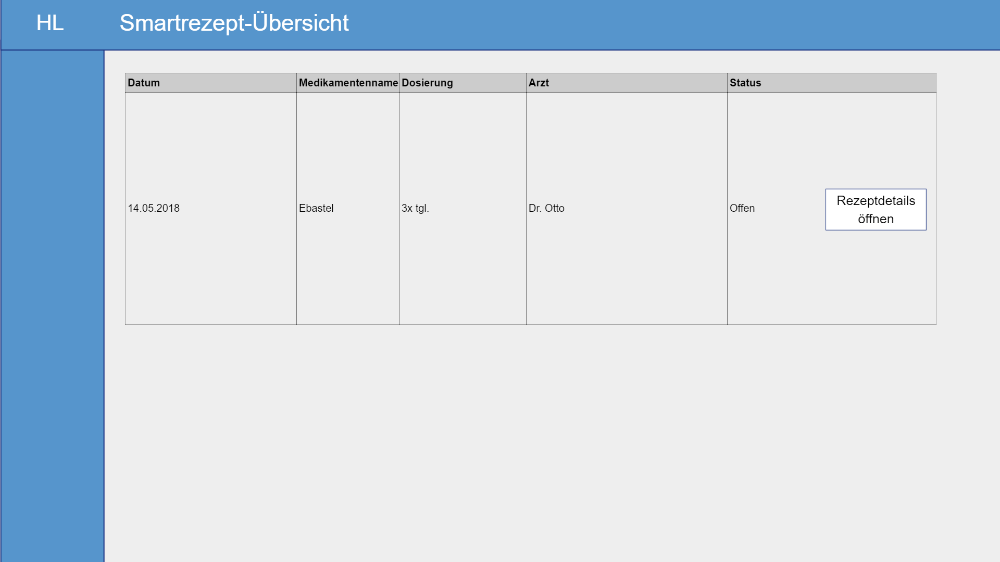

### Apotheker: Rezeptdetails
- UC-9: SmartRezept einsehen
- UC-10: SmartRezept bedienen
- UC-9.1: Medikament anzeigen
- UC-9.2: Behandelnden Arzt anzeigen
- UC-9.3: Datum anzeigen
- UC-9.4: Dosierung anzeigen
- UC-9.5: SmartRezept einlösen

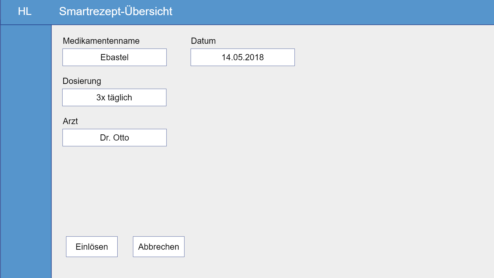

### Arbeitgeber: Mitarbeiterübersicht

### Arbeitgeber: Mitarbeiterakte
- UC-8: Krankschreibung einsehen

### Arzt: Diagnostik:
- UC-5: Behandlung festhalten
- UC-5.1: Vorgang abbrechen
- UC-5.2: Arztrezept hinzufügen
- UC-5.3: Kategorie auswählen
- UC-5.4: Diagnose eintragen
- UC-5.5: Vorgang speichern
- UC-5.6: Krankschreibung hinzufügen
- UC-6.1: Dosierung festlegen
- UC-6.2: Medikament festlegen
- UC-6.3: Anlegen abbrechen
- UC-6.4: Smartrezept speichern
- UC-7.1: Krankschreibung hinzufügen

### Arzt: Smartrezept:
- UC-6 Smartrezept ausstellen

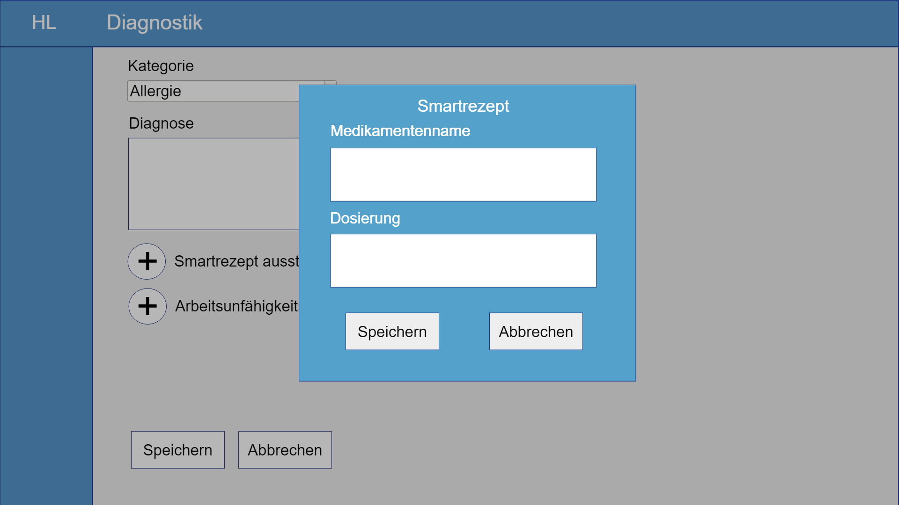

### Arzt: Arbeitsunfähigkeitszeitraum:
- UC-7 Krankschreibung ausstellen

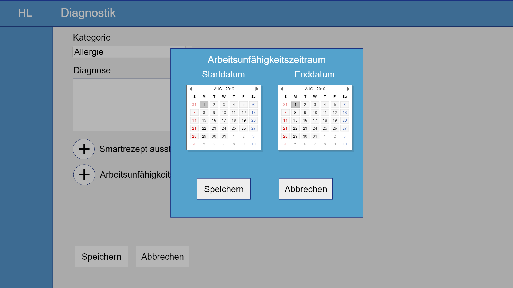

### Arzt/Patient/Versicherung: Behandlungsdetails:
- UC-4: Behandlung einsehen (Arzt/Versicherer)
- UC-4.1: Kategorie anzeigen (Arzt/Versicherer)
- UC-4.2: Diagnose anzeigen (Arzt/Versicherer)
- UC-4.3: Patientenname anzeigen (Arzt/Versicherer)
- UC-4.4: Arztrezept anzeigen (Arzt/Versicherer)

### Arzt/Patient/Versicherung: Krankenakte:
- UC-4.1: Kategorie anzeigen (Arzt/Versicherer)
- UC-4.2: Diagnose anzeigen (Arzt/Versicherer)
- UC-4.3: Patientenname anzeigen (Arzt/Versicherer)
- UC-4.4: Arztrezept anzeigen (Arzt/Versicherer)

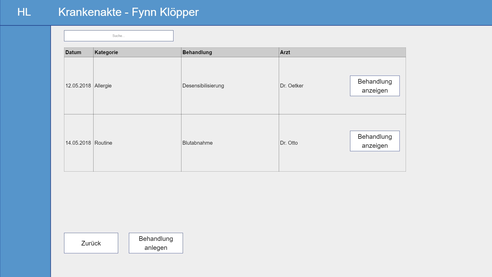

### Arzt/Versicherung: Patientenübersicht:
- UC-3.1: Aktenliste durchsuchen
- UC-3.2: Patientennamen einsehen
- UC-3.3: Public Key einsehen (Arzt)

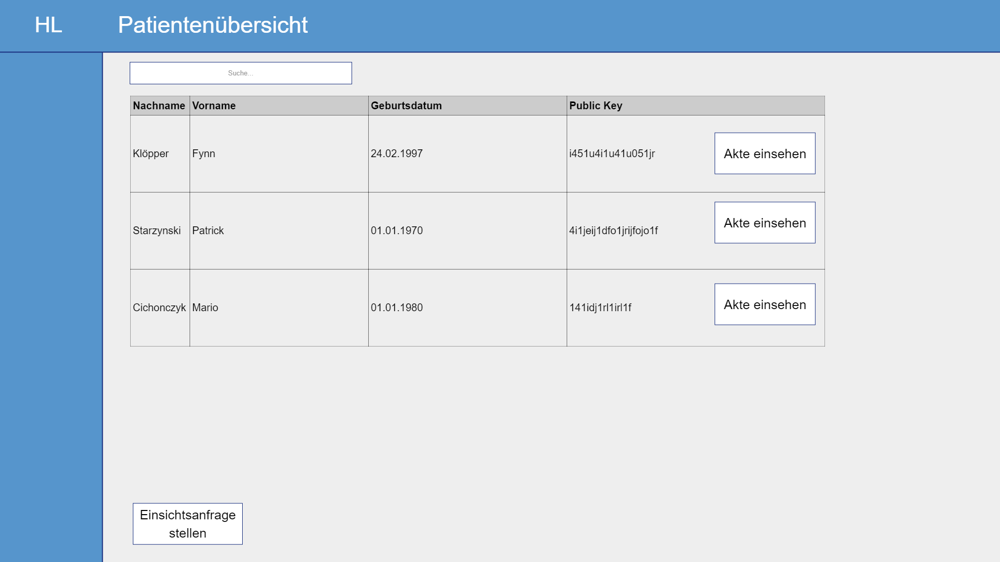

### Arzt/Versicherung/Apotheker/Arbeitgeber: QR-Code-Scanner:

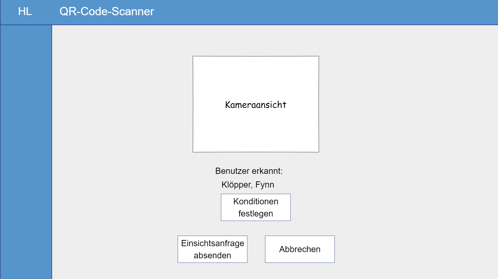

### Patient: Einsichtsanfragen:

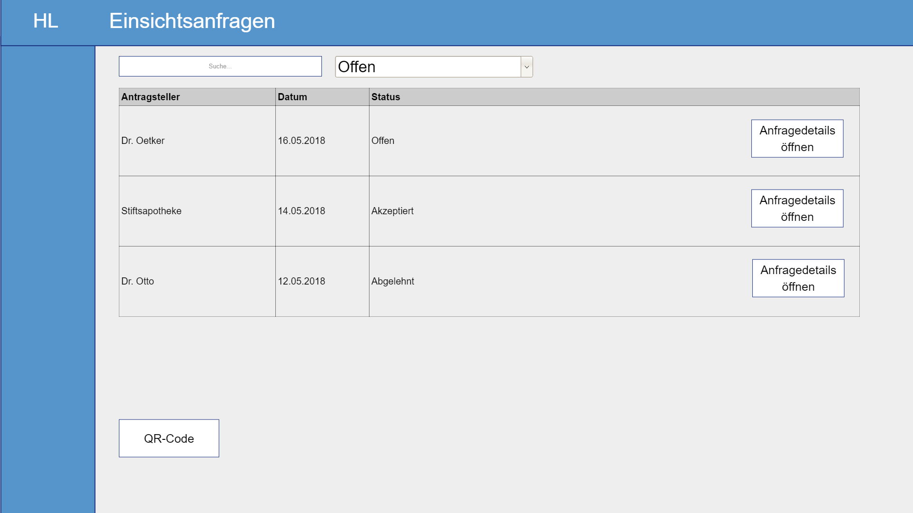

### Arzt/Versicherung/Apotheker/Arbeitgeber: Einsichtsanfragendetails:
- UC-3: Krankenakte einsehen (Arzt, Versicherer)

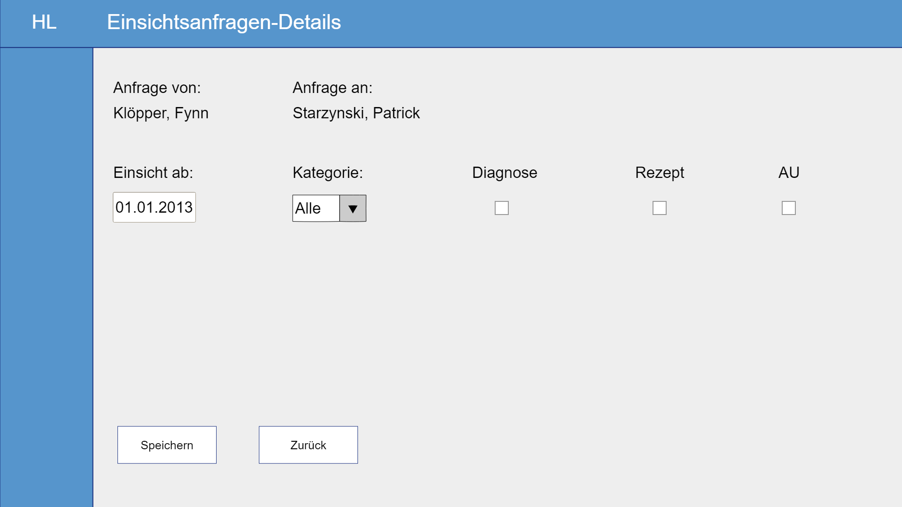

### Patient: Einsichtsanfragendetails:
- UC-1: Transparenz festlegen

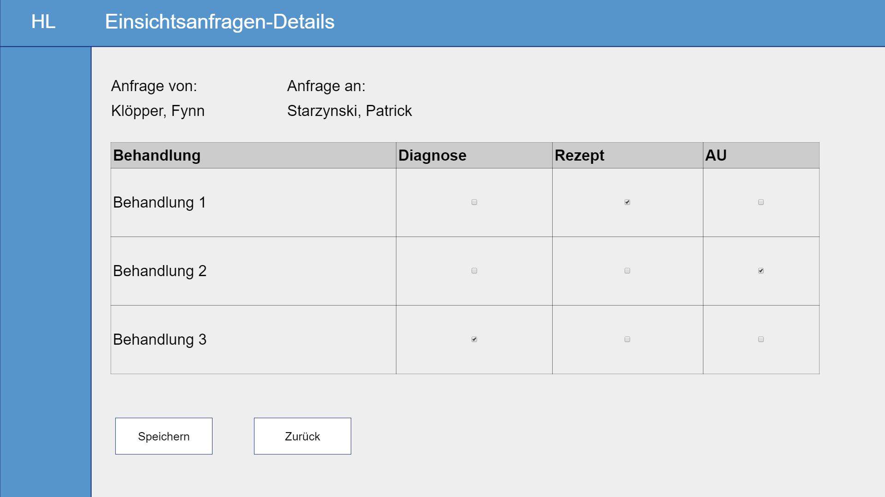

### Patient: Public Key/QR-Code:

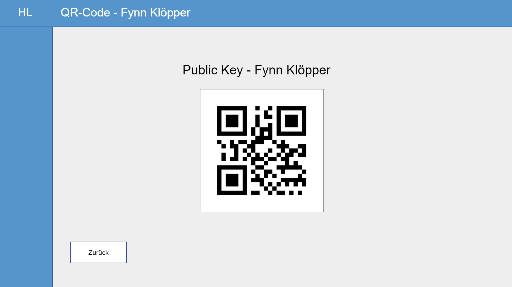

### Zustandsdiagramm des Gesamtsystems:

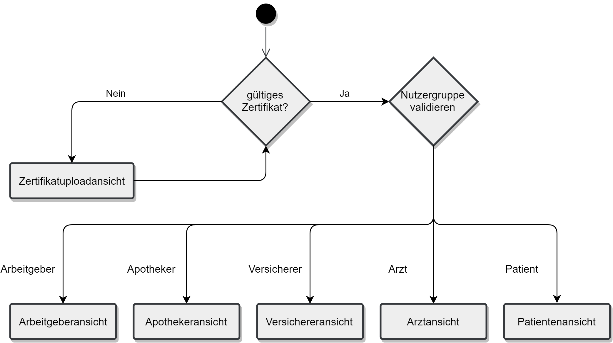

### Detailliertes Zustandsdiagramm der Patientenansicht:

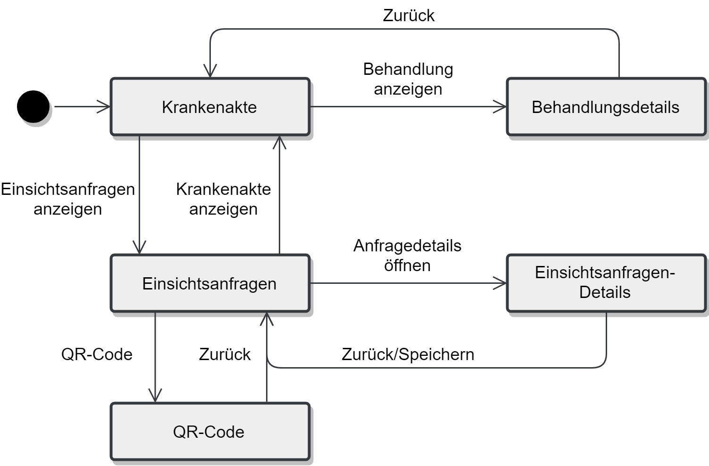

### Detailliertes Zustandsdiagramm der Arztansicht:

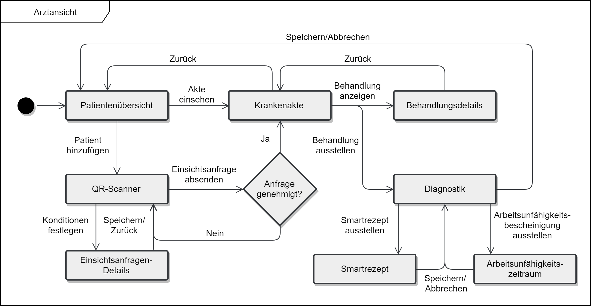

### Detailliertes Zustandsdiagramm der Versichereransicht:

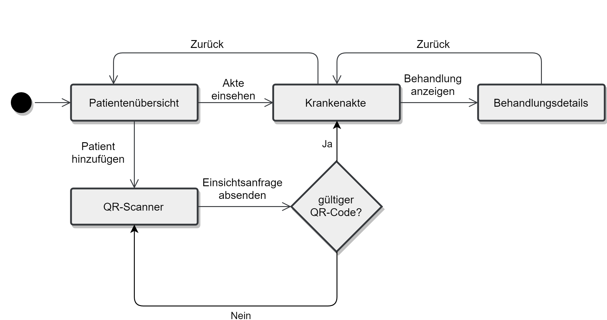

### Detailliertes Zustandsdiagramm der Apothekeransicht:

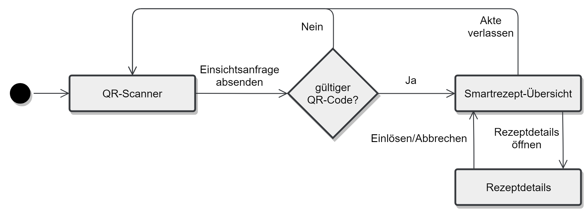

### Detailliertes Zustandsdiagramm der Arbeitgeberansicht:

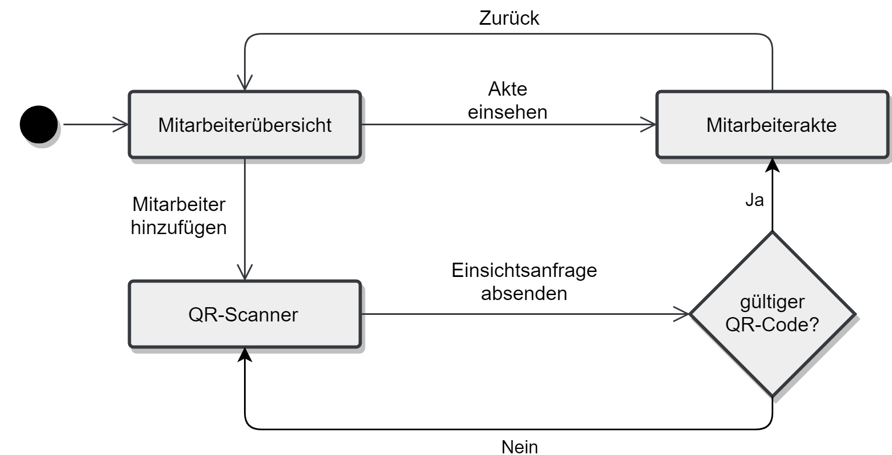

## 2.4 Anforderungen im Detail (Alle)

|  ****Als** ** | ****möchte ich** ** | ** **so dass** ** | ** **Akzeptanz** ** | **Optionalität** |
|  ------ | ------ | ------ | ------ | :------: |
|  Patient | meine Patientenakte einsehen können | ich einen Überblick über meine Behandlungshistorie habe | Historie wird angezeigt | must |
|  Patient | über Anfragen zur Einsicht auf meine Patientenakte entscheiden können | ich Anfragen ablehnen oder akzeptieren kann | Anfragen werden angezeigt | must |
|  Patient | entscheiden können, wieviel eingesehen werden kann | ich die Einsicht auf bestimmte Felder meiner Stammdaten/Behandlungen einschränken kann | nur ausgewählte Daten werden freigegeben | must |
|  Patient | meine Versichertenkarte in Form eines QR Code vorlegen können | die Teilnehmer mir eine Einsichtsanfrage schicken können | Patient erhält Einsichtsanfrage | should |
|  Versicherer | Behandlung einsehen | damit ich über die gestellten Diagnosen informiert bin  | Behandlung wird dargestellt | must |
|  Versicherer | fremde Krankenakte einsehen | Überblick über Behandlungshistorie | Historie angezeigt | must |
|  Arbeitgeber | fremde Krankschreibung einsehen können | fremde Krankschreibung verifizieren | fremde Krankschreibung wird angezeigt | should |
|  Apotheker | fremdes Smart-Rezept einsehen | verschriebene Medikamente auflisten | Medikamente werden angezeigt | must |
|  Apotheker | fremdes Smart-Rezept bedienen | fremdes Rezept als bedient vermerkt ist | fremdes Rezept als Erster bedient | must |
|  Arzt | Krankschreibung ausstellen | für einen fremden Nutzer Krankschreibung angelegt | fremder Nutzer hat neue Krankschreibung | should |
|  Arzt  | Behandlung festhalten | für einen fremden Nutzer Behandlungseintrag hinzugefügt | fremder Nutzer hat neuen Behandlungseintrag | must |
|  Arzt | fremde Krankenakte einsehen | die Krankheitshistorie eines fremden Nutzers nachvollziehen  | Alle für eine Behandlung relevanten Daten sind verfügbar | must |
|  Versicherer, Arbeitgeber, Apotheker, Arzt | Hinweis über Einsichtsverweigerung | Grund der Verweigerung einsehen | Grund wurde nachvollzogen | should |
|  Jeder | Authentifizieren | Rolle im System identifiziert | Teilnahme am System | must |

# 3 Technische Beschreibung (Nils/Kevin/Cem)

## 3.1 Systemübersicht

Abweichend von der Systemarchitektur, wird für den Proof of Concept und die
Präsentation ein Fabric Netzwerk bestehend aus einem Peer, Ordering Service
und MSP mit der Standard Policy Konfiguration aufgesetzt. Die Verteilung der
Fabric-Komponenten kann jedoch ohne weitere Auswirkung auf die Applikation, wie
oben dargestellt vorgenommen werden.

### Schnittstellenbeschreibung
Für die Interaktion mit dem Distributed Ledger stellt das Hyperledger Fabric
Framework ein SDK für NodeJs bereit. Dieses nutzt Protocol Buffers und gRPC um
mit den Knoten im Netzwerk zu kommunizieren. Da das SDK jedoch mit dem
Dateisystem arbeitet, kann es nicht direkt im Browser ausgeführt werden.
Für diesen Zweck wird zwischen der Web-Applikation und dem Distributed Ledger
eine REST-Schnittstelle als Proxy implementiert, mit der die indirekte
Kommunikation der beiden Module ermöglicht wird.

## 3.2 Softwarearchitektur

## 3.3 Datenmodell

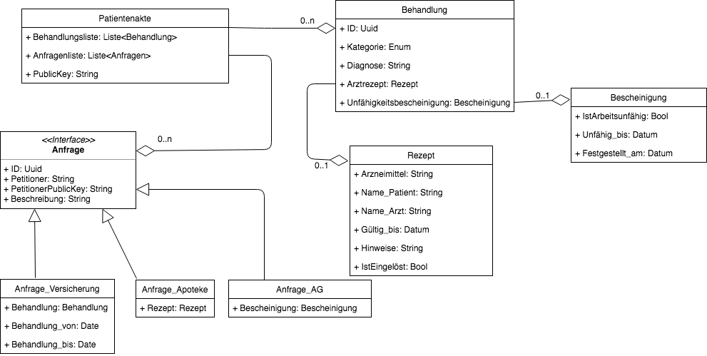

## 3.4 Abläufe
Dieses Aktivitätsdiagramm soll zeigen, wie der Arzt bei der Erstellung einer Behandelung mit
der Blockchain interagiert.

Im folgenden Usecase wird dargestellt, wie ein User wie beispielsweise die Krankenkasse an die
benötigten Informationen gelangt. Dabei kann der Patient selbst entscheiden, ob er die benötigten
Informationen herrausgeben möchte.

* Aktivitätsdiagramme für relevante Use Cases
* Aktivitätsdiagramm für den Ablauf sämtlicher Use Cases

Um über die einzelnen Use-Cases einen besseren Überblick zu erlangen, wurden für jeden der Use-Cases ein Aktivitätsdiagramm erstellt. Diese sollen zeigen, welcher Teil des Use-Cases auf dem Webclient ausgeführt wird und welches Teil von dem Chaincode übernommen wird.

### Usecase 1: Transparenz festlegen
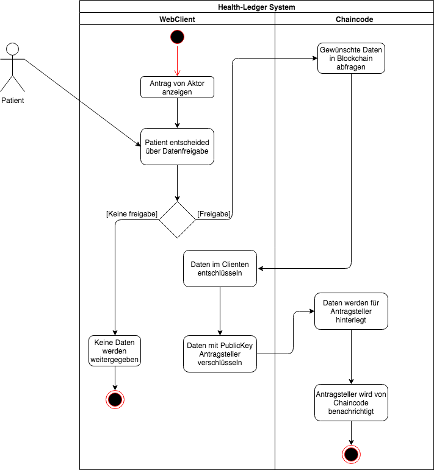

### Usecase 2: Einsicht anfordern
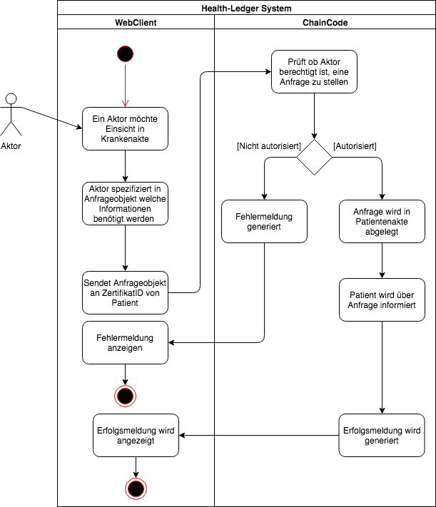

### Usecase 3: Krankenakte einsehen
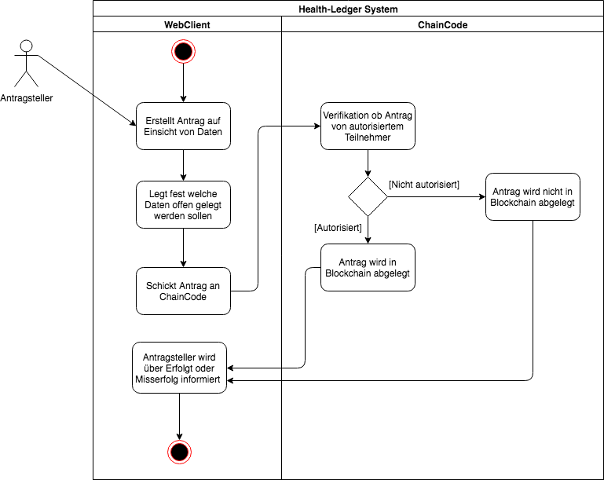

### Usecase 4: Behandlung einsehen
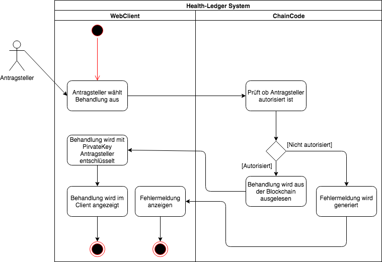

### Usecase 5: Behandlung festhalten
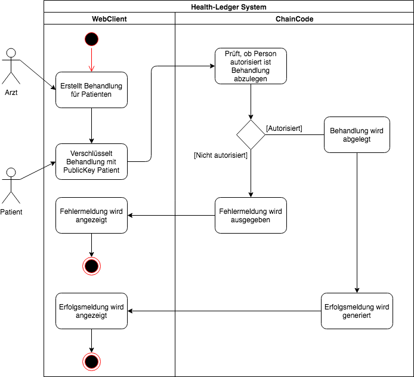

### Usecase 6: SmartRezept ausstellen
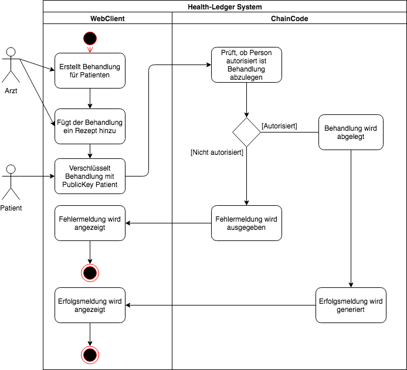

### Usecase 7: Krankschreibung ausstellen

### Usecase 8: Krankschreibung einsehen
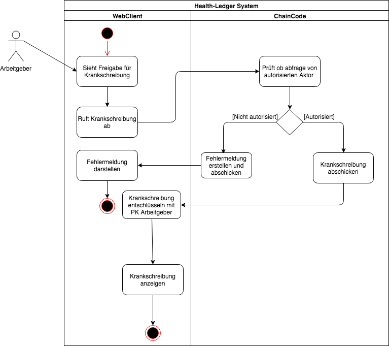

### Usecase 9: SmartRezept einsehen
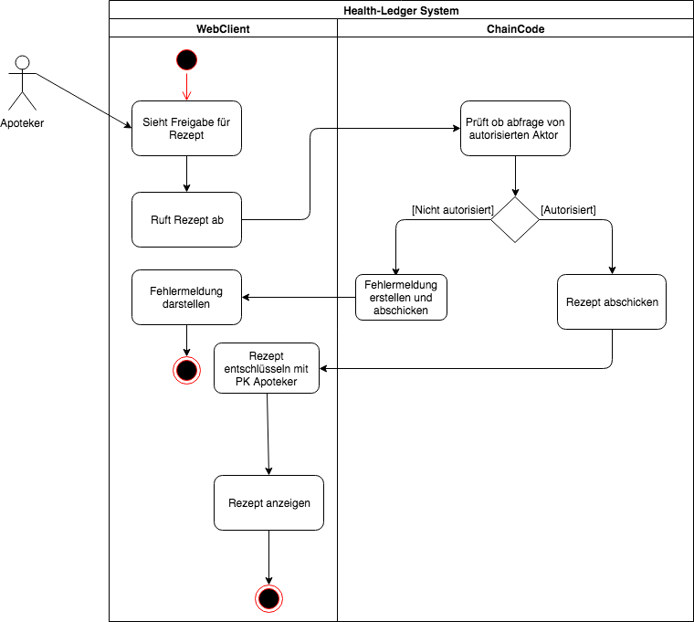

### Usecase 10: SmartRezept bedienen
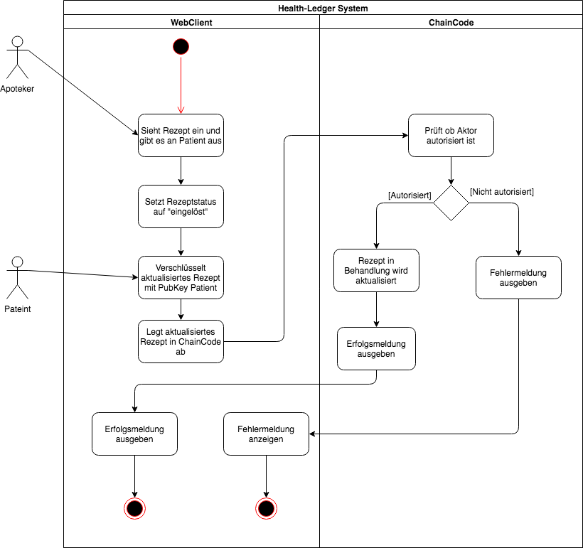

## 3.5 Entwurf

# 4 Projektorganisation

## 4.1 Annahmen

Um die Sicherheit der patientenbezogenen Daten zu gewährleisten, ist es
unabdingbar, dass der Private-Key zu keinem Zeitpunkt den Hoheitsbereich des Patienten verlässt. Dies wird sichergestellt indem alle von der
Ver- und Entschlüsselung betroffenen Komponenten, in der Client Applikation implementiert werden.

### Technologien

#### Distributed Ledger / Smart Contract
* Programmiersprachen
  * JavaScript
* Frameworks / Libraries
  * Hyperledger Fabric
  * NodeJS
  * Fabric Shim

#### Backend
* Programmiersprachen
  * Javascript
* Frameworks / Libraries
  * NodeJS
  * Fabric Node SDK
  * Express.JS

#### Frontend
* Programmiersprachen
  * Typescript
* Frameworks / Libraries
  * Angular
  * Angular Material Design

#### Entwicklung / Integration

* Versionsverwaltung: Git
* Entwicklungsumgebungen (IDEs): VSCode, Atom, WebStorm
* Repository: Github
* Deployment: Github Pages, Azure

## 4.2 Verantwortlichkeiten

### Komponenten und Module

| Komponente / Modul | Name |
|----------|-----------|
| Chaincode (Business Logic) |  |
| Application Logic |  |
| REST API |  |
| Chain Service |  |
| Storage Service |  |
| Crypto Service |  |
| Frontend | . |

### Rollen

#### Softwarearchitekt
Entwirft den Aufbau von Softwaresystemen und trifft grundlegende Entscheidungen über das Zusammenspiel ihrer diversen Komponenten.

#### Frontend-Entwickler
Entwickelt graphische oder andere Benutzerschnittstellen, insbesondere das Layout einer Anwendung.

#### Backend-Entwickler
Implementiert die funktionale Logik der Anwendung. Hierbei werden zudem diverse Datenquellen und externe Dienste integriert und für die Anwendung bereitgestellt.

#### Chaincode-Entwickler
Entwickelt Programmlogik die auf Hyperledger Nodes ausgeführt wird und mit der Blockchain interagiert.

#### DevOps-Spezialist
Entwickelt Prozesse, Tools und legt eine Infrastruktur an, die eine bessere Koordination zwischen den Projektteilnehmern ermöglicht.

### Rollenzuordnung

| Name     | Rolle     |
|----------|-----------|
| Cem      | Softwarearchitekt, Chaincode-Entwickler, Backend-Entwickler |
| Fynn     | Frontend-Entwickler |
| Kevin    | Backend-Entwickler |
| Mario    | Backend-Entwickler |
| Matthias | Backend-Entwickler |
| Nils     | Frontend-Entwickler, Backend-Entwickler |
| Patrick  | Frontend-Entwickler |

## 4.3 Grober Projektplan
### Meilensteine
* KW 21 (21.05)
  * Abgabe Pflichtenheft
* KW 22 (28.05) / M1
  * Projekt aufsetzen
* KW 23 (04.06) / M2
  * SW-Architektur
* KW 25 (18.06) / M3
  * Implementierung: Funktionale Anforderungen
* KW 26 (25.06)
  * Präsentation / Software-Demo
